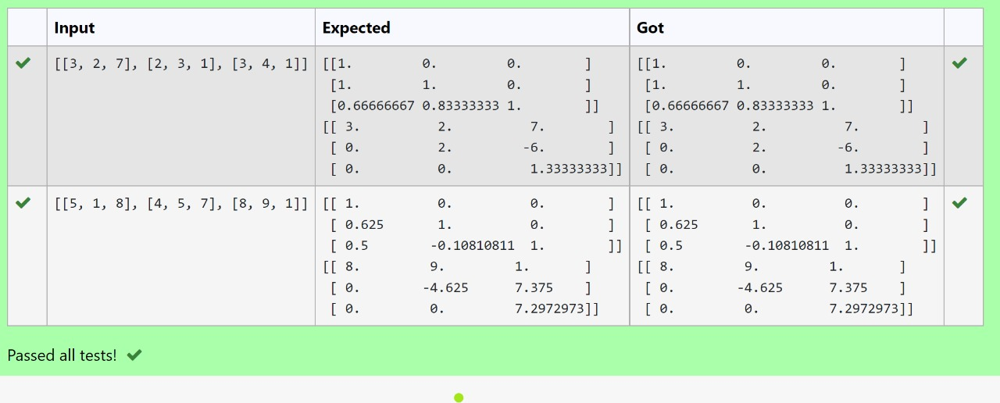
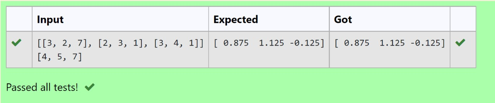

#  5 a) LU Decomposition without zero on the diagonal

## AIM:
To write a program to find the LU Decomposition of a matrix.

## Equipments Required:
1. Hardware – PCs
2. Anaconda – Python 3.7 Installation / Moodle-Code Runner

## Algorithm :

### STEP 1:
 import numpy libray using import statement.

### STEP 2:
from scipy package import lu().

### STEP 3:
get the input from user and pass it as an array.

### STEP 4:
get P,L,U matrix using lu()

### STEP 5:
print Land U matrix.

## Program:
```

Program to find the LU Decomposition of a matrix.
Developed by: Monisha T
RegisterNumber: 21500314

# To print L and U matrix
import numpy as np
from scipy.linalg import lu
#import scipy
A = np.array(eval(input()))
P, L , U = lu(A)
#P,L,U = scipy.linalg.lu(A)
print(L)
print(U)
```


## Output:



## Result:
Thus the program to find the LU Decomposition of a matrix is written and verified using python programming.


#  5 b) LU Decomposition without zero on the diagonal

## AIM:
To write a program to find the LU Decomposition of a matrix.

## Equipments Required:
1. Hardware – PCs
2. Anaconda – Python 3.7 Installation / Moodle-Code Runner

## Algorithm :

### STEP 1:
 import numpy libray using import statement.

### STEP 2:
from scipy package import lu_factor and lu_solve.

### STEP 3:
get two  input from user and pass it as matrix array.

### STEP 4:
find lu and pivot value of first matrix using lu_factor()

### STEP 5:
find solution of the matrix by using lu_solve() by passing lu,pivot values as first argument and second matrix as second arugment.

### STEP 6:
print the solution.
## Program:
```

Program to find the LU Decomposition of a matrix.
Developed by: Monisha T
RegisterNumber: 21500314

# To print X matrix (solution to the equations)
import numpy as np
from scipy.linalg import lu_factor, lu_solve
A = np.array(eval(input()))
B = np.array(eval(input()))
lu, pivot = lu_factor(A)
x = lu_solve((lu,pivot),B)
print(x)
```


## Output:



## Result:
Thus the program to find the LU Decomposition of a matrix is written and verified using python programming.

